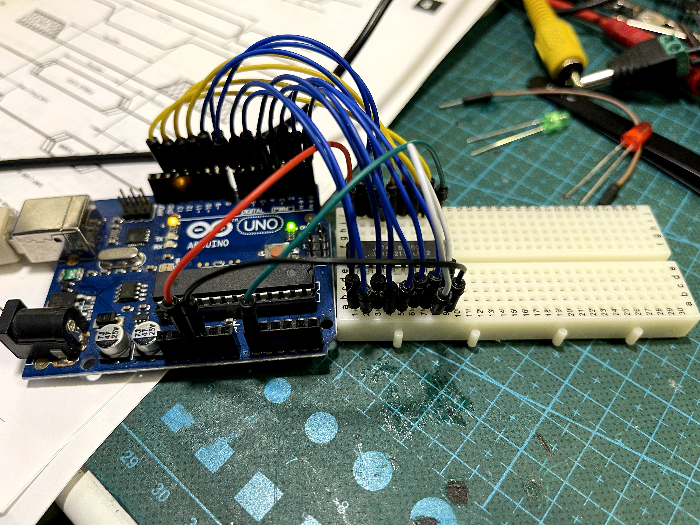

# 2114 SRAM tester

I got my hands on an old Lambda 8300 home computer, which was not working.

The only sign of life was a blinking cursor, but no keys were working on the keyboard, so I had to start fault finding.

Obviously the the first thing I checked was the connections to the keyboard, where I found a few problems, but that didn't solve the problem of the machine not working.

So next thing was to check the RAM which is often the problem on old machines.

This machine has four 2114 1024x4 SRAM chips giving it 2K of memory, but I had no way of testing these chips.

So I thought that it must be possible to create a simple tester with an Arduino, and so I did.

The source code has comments to explain what the different parts do, and how to connect the wires.

## Programming the Arduino

To get the sketch into the Arduino, just open the .ino file in the Arduino IDE and select your Board and Port in the Arduino IDE Tools menu.
Then Upload and the program runs.

It only runs once, so you can push the Reset button on the Arduino to make it run again.

## Connections

Here is the pinout of the 2114 RAM chip

I used the following wire colors:
* Blue for the address pins, 
* Yellow for the I/O data pins
* Red for +5V (VCC)
* Black for Ground
* Green for the WE pin
* White to connect CS to GND.

## Board setup

This is how it looks in my setup.

## Output

The output is shown in the Arduino IDE Serial Monitor, so you have to keep that open and set to 115200.

Here is the output from a successful run.

